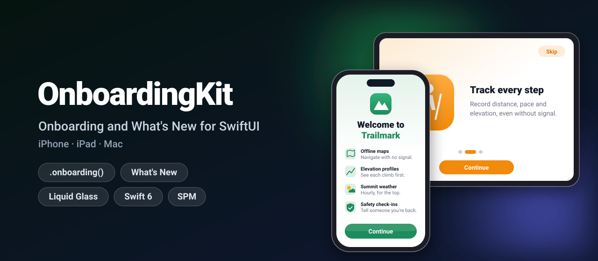
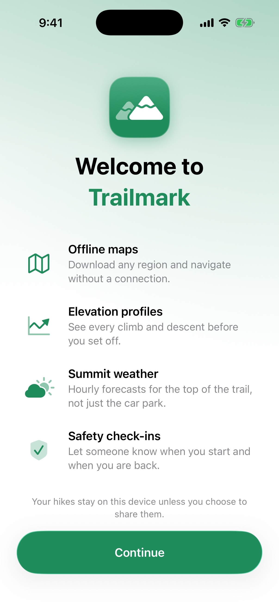
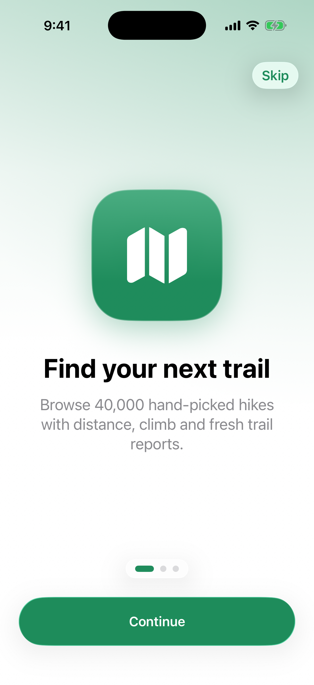
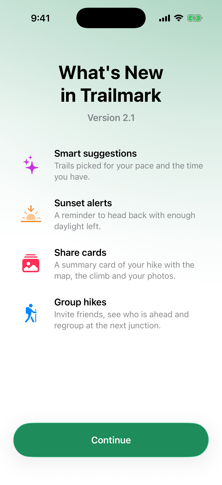
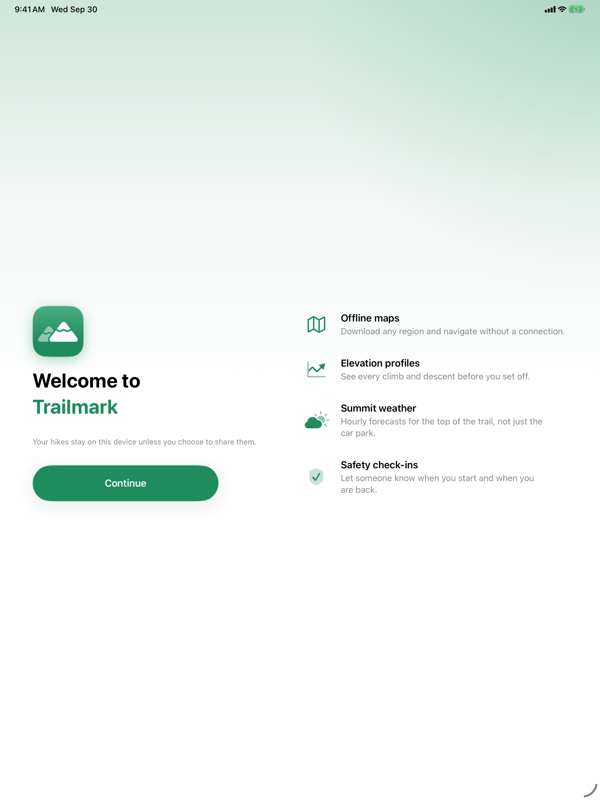
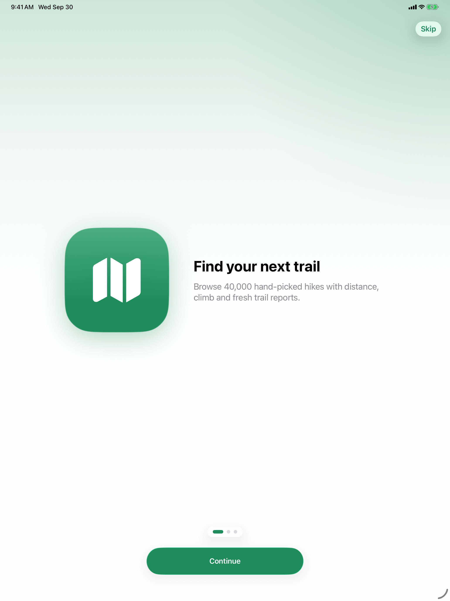
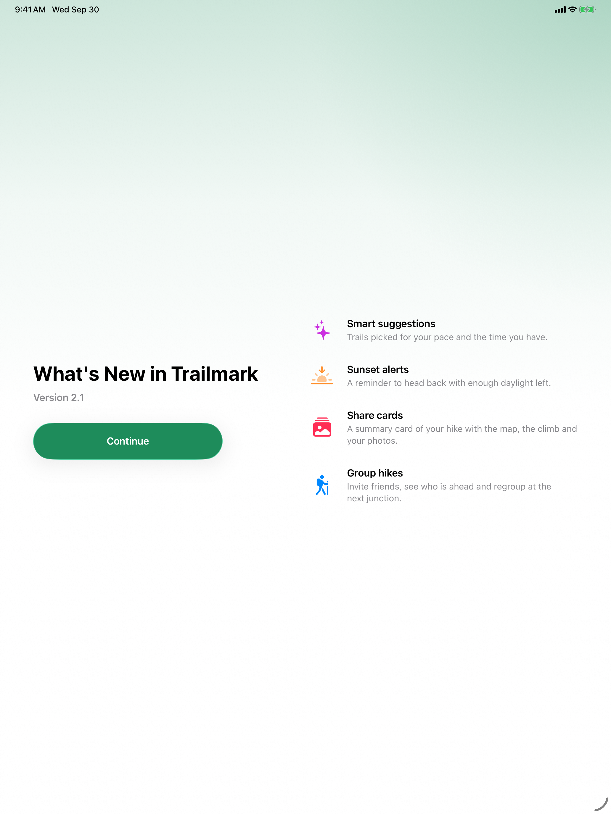

<p align="center">
  
</p>

<p align="center">
  <a href="https://github.com/halilozel1903/OnboardingKit/actions/workflows/ci.yml"></a>
  
  
  
  
  <a href="LICENSE"></a>
</p>

**OnboardingKit** gives your SwiftUI app the first-launch and after-update screens people know from Apple's own apps: a **paged intro**, a **"Welcome to" feature list** and a **"What's New" sheet** for each release. A small, tested gate decides when to show them: onboarding once, What's New once per new release, never after a bug fix update and never twice. Buttons use Liquid Glass on iOS 26 and macOS 26, and every screen switches to a two-column layout on iPad and Mac.

```swift
ContentView()
    .onboarding(pages: pages)     // first launch only
    .whatsNew(releases)           // once after each update to a new release
```

## Screenshots

Captured from the example app on iOS 26 simulators by CI.

| Welcome | Paged intro | What's New |
| :---: | :---: | :---: |
|  |  |  |

On iPad (and on the Mac) the same screens use two columns:

<p align="center">
  
</p>

| iPad intro | iPad What's New |
| :---: | :---: |
|  |  |

## Features

- **Paged intro** (`OnboardingView`): a large icon, a title and a description per page, capsule page dots, Continue that turns into Get Started on the last page, and Skip. Swipe on iPhone and iPad; arrow keys and a Back button on the Mac.
- **Welcome screen** (`WelcomeView`): "Welcome to *App*", a list of features with icons, an optional privacy note and a Continue button, as in Apple's apps.
- **What's New** (`WhatsNewView`): the features of a release with its version number, shown as a sheet.
- **Show once, per version**: `OnboardingGate` shows onboarding on the first launch and What's New after an update to a new minor (or major, or patch) version. Semantic version comparison, pre-releases included; downgrades never show old news.
- **Right release notes**: pass every release and the gate picks the newest one the user has not seen, even when the running version has no notes of its own.
- **One-line modifiers**: `.onboarding(pages:)`, `.onboarding { … }` for your own screen, `.whatsNew(_:)`, plus `isPresented:` variants for a Help menu.
- **Adaptive**: one column on iPhone, two columns from 700 points wide (iPad, Mac, iPhone Pro Max in landscape). Full screen on iOS, a sheet on the Mac.
- **Liquid Glass**: `.glassProminent` and `.glass` buttons and a glass page indicator on iOS 26 and macOS 26; bordered buttons and materials on iOS 18 and macOS 15.
- **Injectable storage**: `UserDefaults` by default, in memory for tests and previews, or your own `OnboardingStorage` (iCloud, a server).
- **Accessible**: Dynamic Type, VoiceOver labels for the page dots, headers marked as headers, the default action on Return.
- **Swift 6 strict concurrency**, zero dependencies, tested with Swift Testing.

## Installation

In Xcode choose **File › Add Package Dependencies…** and enter:

```
https://github.com/halilozel1903/OnboardingKit
```

Or add it to `Package.swift`:

```swift
dependencies: [
    .package(url: "https://github.com/halilozel1903/OnboardingKit", from: "1.0.0")
]
```

## Quick start

```swift
import OnboardingKit
import SwiftUI

@main
struct TrailmarkApp: App {
    let pages = [
        OnboardingPage(systemImage: "map.fill", title: "Find your next trail",
                       subtitle: "Browse 40,000 hand-picked hikes.", tint: .green),
        OnboardingPage(systemImage: "figure.hiking", title: "Track every step",
                       subtitle: "Distance, pace and climb, even without a signal.", tint: .orange),
        OnboardingPage(systemImage: "person.2.fill", title: "Hike together",
                       subtitle: "Share your location and meet at the summit.", tint: .indigo),
    ]

    let releases = [
        WhatsNew(version: "2.1", features: [
            OnboardingFeature(systemImage: "sparkles", title: "Smart suggestions",
                              subtitle: "Trails picked for your pace and the time you have."),
            OnboardingFeature(systemImage: "sunset.fill", title: "Sunset alerts",
                              subtitle: "A reminder to head back with enough daylight left."),
        ]),
    ]

    var body: some Scene {
        WindowGroup {
            ContentView()
                .onboarding(pages: pages)
                .whatsNew(releases)
        }
    }
}
```

The first launch shows the intro. Finishing or skipping it records the running version (`CFBundleShortVersionString`), so the What's New sheet for that version does not follow. When the user later updates to 2.1, the sheet for 2.1 appears once.

## Usage

### Paged intro

```swift
OnboardingView(pages: pages, style: OnboardingStyle(tint: .green)) {
    // finished or skipped
}
```

Each page takes an SF Symbol (drawn white on a tile in the page's tint) or an image from your asset catalog:

```swift
OnboardingPage(image: .asset("Welcome"), title: "Welcome", subtitle: "…")
```

### Welcome screen

```swift
WelcomeView(
    appName: "Trailmark",                         // "Welcome to" + the name in the tint
    image: .asset("AppIconImage"),                // optional
    features: [
        OnboardingFeature(systemImage: "map", title: "Offline maps",
                          subtitle: "Download any region and navigate without a connection."),
        OnboardingFeature(systemImage: "cloud.sun.fill", title: "Summit weather",
                          subtitle: "Hourly forecasts for the top of the trail.", tint: .orange),
    ],
    footnote: "Your hikes stay on this device unless you share them."
) {
    // Continue
}
```

Show it once like the intro, with your own screen inside `.onboarding { }`. Dismissing it records onboarding as completed:

```swift
ContentView()
    .onboarding {
        WelcomeScreen()   // calls @Environment(\.dismiss) when the user taps Continue
    }
```

### What's New

```swift
.whatsNew(release)                           // one release
.whatsNew([release20, release21, release30]) // the newest one the user has not seen
.whatsNew(releases, showsOnFirstLaunch: true)
.whatsNew(release, isPresented: $showsWhatsNew) // from a Help menu
```

With releases for 2.0 and 2.1:

| Update | Sheet |
| --- | --- |
| Fresh install of 2.1 | none (the version is recorded) |
| 2.0 → 2.1 | 2.1 |
| 1.4 → 2.1.2 | 2.1 |
| 2.1 → 2.1.3 | none: a bug fix release |
| 2.1 → 2.2 (no notes for 2.2) | none: 2.1 was already seen |
| 2.0 → 2.2 (no notes for 2.2) | 2.1 |
| 2.1 → 2.0 (downgrade) | none |

### Styling

```swift
let style = OnboardingStyle(
    tint: .green,
    continueTitle: "Next",
    finishTitle: "Start Hiking",
    skipTitle: "Not Now",
    showsSkipButton: true,
    showsBackgroundGlow: true
)
```

Every label is a `LocalizedStringResource`, so literals are looked up in your app's string catalog.

### The gate on its own

`OnboardingGate` has no UI. Use it to drive screens of your own or to decide something else at launch:

```swift
let gate = OnboardingGate()                                   // UserDefaults.standard, minor releases

switch gate.decision(for: AppVersion.current!) {
case .onboarding: showsOnboarding = true
case .whatsNew(let previous): print("Updated from \(previous)")
case .nothing: break
}

gate.markOnboardingCompleted(version: .current)
gate.markWhatsNewSeen(version: "2.1")
gate.reset()                                                  // for a debug menu
```

| Option | Default | Meaning |
| --- | --- | --- |
| `storage` | `UserDefaultsOnboardingStorage()` | Where the two values are kept. `InMemoryOnboardingStorage()` for tests and previews, or your own `OnboardingStorage`. |
| `keyPrefix` | `"OnboardingKit"` | Use another prefix for an independent flow, such as a tour of one feature. |
| `granularity` | `.minor` | Which change counts as a new release: `.major`, `.minor` or `.patch`. |

Pass the same gate to `.onboarding(pages:gate:)` and `.whatsNew(_:gate:)`.

### Versions

`AppVersion` parses and compares versions by the rules of [Semantic Versioning](https://semver.org):

```swift
AppVersion(string: "2.1")             // 2.1.0
AppVersion(string: "v3.0.0-beta.2")   // 3.0.0-beta.2
AppVersion(string: "2.x")             // nil
let version: AppVersion = "2.1"       // string literal

AppVersion(1, 10) > AppVersion(1, 9)                            // true, not a string comparison
AppVersion(string: "2.0.0-rc.1")! < AppVersion(2, 0)            // true
AppVersion(2, 1, 3).isNewRelease(comparedTo: "2.1")             // false
AppVersion(2, 1, 3).isNewRelease(comparedTo: "2.1", granularity: .patch) // true
```

### Build your own pager

`OnboardingPager` is the navigation state behind `OnboardingView`:

```swift
var pager = OnboardingPager(pageCount: 3)
pager.next()        // index 1
pager.previous()    // index 0
pager.go(to: 9)     // clamped to 2
pager.next()        // on the last page: isFinished == true
```

`OnboardingPageIndicator(count:index:tint:)` draws the page dots.

## How it works

| | iPhone | iPad | Mac |
| --- | --- | --- | --- |
| Intro and welcome | Full screen, one column | Full screen, two columns | Sheet, two columns |
| What's New | Sheet | Form sheet | Sheet |
| Paging | Swipe | Swipe | Arrow keys, Back button |

| | iOS 26 / macOS 26 | iOS 18 / macOS 15 |
| --- | --- | --- |
| Buttons | `.glassProminent`, `.glass` | `.borderedProminent`, `.bordered` |
| Page dots | `glassEffect` capsule | `.ultraThinMaterial` capsule |

The gate stores two strings: the version in which onboarding was completed and the newest version whose news the user has seen. A decision compares the running version with the stored one after cutting both down to the granularity, so `2.1.4` and `2.1.0` are the same release at `.minor`.

## Example app

The `Example` folder contains *Trailmark*, a made-up hiking app for iPhone and iPad. It shows the intro on its first launch and has buttons for every screen and a reset. It uses [XcodeGen](https://github.com/yonaskolb/XcodeGen) so no project file has to live in the repo:

```bash
brew install xcodegen
cd Example && xcodegen generate
open OnboardingKitDemo.xcodeproj
```

## Requirements

- Xcode 26 or later (Swift 6.2 toolchain)
- iOS 18+, iPadOS 18+, macOS 15+ (Liquid Glass automatically on 26+)

## Contributing

Issues and pull requests are welcome. Please run `swift test` before opening a PR.

## License

OnboardingKit is available under the MIT license. See [LICENSE](LICENSE).
